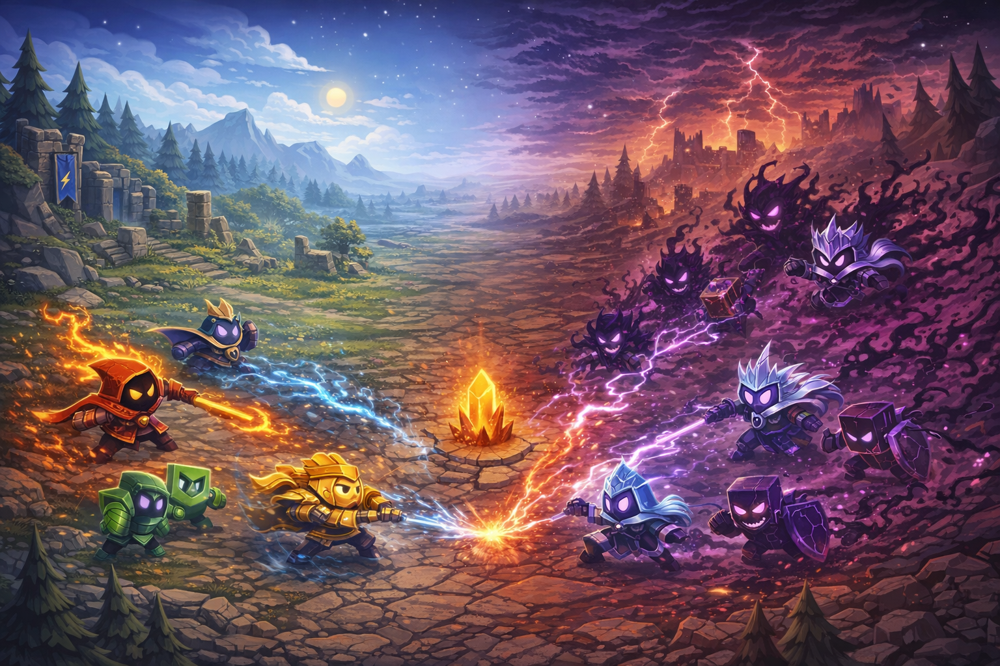

# Shape Strikers ⚔️

A tactical lane-based auto-battler built with **vanilla HTML, CSS, and JavaScript** — no game engine required.

🎮 **[Play Now](https://bytesower.github.io/ShapeStrikers-no-phaser-/)**



---

## About

Shape Strikers is a rogue-like auto-battler where you buy, place, and upgrade shape-drawn units to fight through waves of enemies. Strategy comes from **element synergies**, **unit positioning**, and **economy management**.

### Features

- **44 unique units** across 4 tiers and 8 elements (39 playable + 5 bosses)
- **Lane-based combat** on a 6×5 grid with automatic pathfinding
- **5 boss fights** with multi-phase mechanics (Waves 5, 10, 15, 20, 25)
- **2 campaign modes** — Normal (15 waves) and Void Campaign (25 waves with hard mode scaling)
- **Element synergy system** — stack elements for stat bonuses
- **10 status effects** — burn, poison, freeze, slow, shield, barrier, weaken, wound, untargetable, blind
- **Advanced mechanics** — evolve, knockback, pull, kill-stacking
- **Shop & economy** — buy, sell, refresh, earn interest, purchase upgrades
- **Seeded wave generator** — different compositions each run
- **CSS particle VFX engine** — element-colored effects, projectiles, shockwaves, screen shake
- **Guided tutorial** with spotlight highlights
- **Unit glossary & guidebook** — learn every unit and mechanic in-game
- **Procedural shape-drawn units** — no sprite assets needed for characters
- **Dark mode** and **mobile layout** support

### Elements

| Element | Synergy Bonus |
|---------|--------------|
| 🔥 Fire | +ATK |
| 🧊 Ice | +DEF |
| ⚡ Lightning | +SPD |
| 🌍 Earth | +HP |
| 🩸 Blood | +ATK |
| ☠️ Plague | +ATK |
| ✨ Arcane | +ATK / +SPD (unlockable) |
| 🕳️ Void | +ATK / +HP (unlockable) |

## How to Play

1. **Buy units** from the shop using gold
2. **Place them** on your side of the grid (bottom 2 rows)
3. **Press Fight** — units auto-battle toward the center battle line
4. **Win waves** to earn gold, then spend it on more units and upgrades
5. **Survive 15 waves** (Normal) or **25 waves** (Void Campaign) to win

### Campaign Modes

| Mode | Waves | Bosses | Unlock |
|------|-------|--------|--------|
| **Normal** | 15 | Sun Dragon (W5), Frost Giant (W10), Void Supreme (W15) | Available from start |
| **Void Campaign** | 25 | + Void Leviathan (W20), Void Architect (W25) | Beat Normal mode once |

Void Campaign features **hard mode scaling** — enemy stats increase from waves 16-25 (up to 2× HP, 1.6× ATK). Void units become available to players.

## Running Locally

No build step needed. Just serve the files:

```bash
# Python
python3 -m http.server 8000

# Node
npx serve .
```

Then open `http://localhost:8000` in your browser.

## Tech Stack

- **HTML5 / CSS3 / ES6+ JavaScript** — zero dependencies
- **Canvas API** — for unit shape rendering
- **GitHub Pages** — static hosting via Actions workflow

## Privacy

Shape Strikers stores settings, unlocks, and run-related progress in your browser using local storage. If you submit a leaderboard score, the game stores your chosen display name, score, and run summary using anonymous Supabase authentication. No email or password is required.

## Documentation

- [GAME_DESIGN.md](GAME_DESIGN.md) — Full game design document (rules, stats, formulas, mechanics)
- [PROGRESS.md](PROGRESS.md) — Development progress tracker and roadmap
- [AUDIT.md](AUDIT.md) — Codebase audit and architecture assessment

## License

MIT

---

*Made by [ByteSower](https://github.com/ByteSower)*
