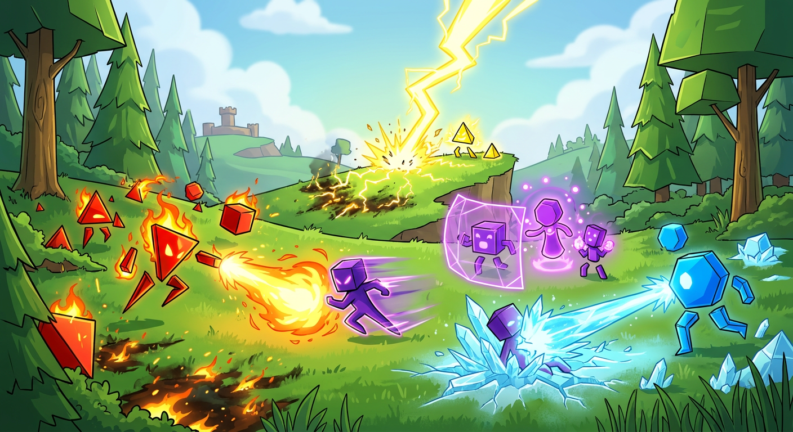

# Shape Strikers ⚔️

A tactical lane-based auto-battler built with **vanilla HTML, CSS, and JavaScript** — no game engine required.

🎮 **[Play Now](https://bytesower.github.io/ShapeStrikers-no-phaser-/)**



---

## About

Shape Strikers is a rogue-like auto-battler where you buy, place, and upgrade shape-drawn units to fight through 15 waves of enemies. Strategy comes from **element synergies**, **unit positioning**, and **economy management**.

### Features

- **28+ unique units** across 4 tiers and 6 elements
- **Lane-based combat** on a 6×5 grid with automatic pathfinding
- **3 boss fights** with multi-phase mechanics (Waves 5, 10, 15)
- **Element synergy system** — stack elements for stat bonuses
- **9 status effects** — burn, poison, freeze, slow, shield, barrier, weaken, wound, untargetable
- **Shop & economy** — buy, sell, refresh, earn interest, purchase upgrades
- **Seeded wave generator** — different compositions each run
- **Guided tutorial** with spotlight highlights
- **Unit glossary & guidebook** — learn every unit and mechanic in-game
- **Procedural shape-drawn units** — no sprite assets needed for characters

### Elements

| Element | Synergy Bonus |
|---------|--------------|
| 🔥 Fire | +ATK |
| 🧊 Ice | +DEF |
| ⚡ Lightning | +SPD |
| 🌍 Earth | +HP |
| ✨ Arcane | +ATK / +SPD |
| 🕳️ Void | Enemy-exclusive |

## How to Play

1. **Buy units** from the shop using gold
2. **Place them** on your side of the grid (bottom 2 rows)
3. **Press Fight** — units auto-battle toward the center battle line
4. **Win waves** to earn gold, then spend it on more units and upgrades
5. **Survive 15 waves** including 3 boss encounters to win

## Running Locally

No build step needed. Just serve the files:

```bash
# Python
python3 -m http.server 8000

# Node
npx serve .
```

Then open `http://localhost:8000` in your browser.

## Tech Stack

- **HTML5 / CSS3 / ES6+ JavaScript** — zero dependencies
- **Canvas API** — for unit shape rendering
- **GitHub Pages** — static hosting via Actions workflow

## Documentation

See [GAME_DESIGN.md](GAME_DESIGN.md) for the full game design document covering all rules, stats, formulas, and mechanics.

## License

MIT

---

*Made by [ByteSower](https://github.com/ByteSower)*
